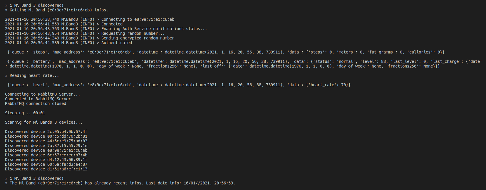
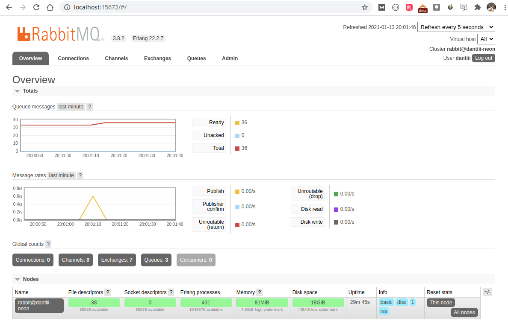
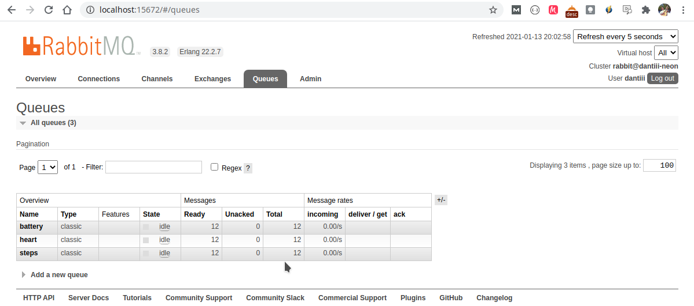
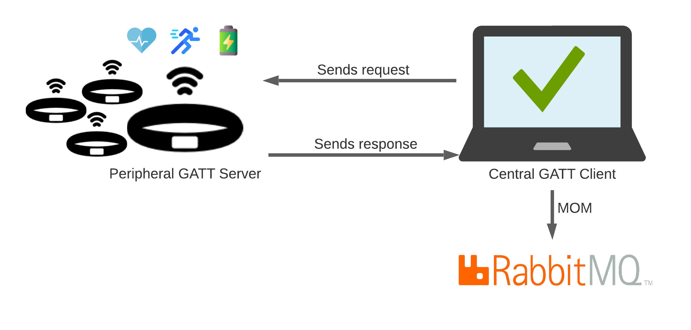

# IoT Mini Project » Bluetooth BLE

``` 
---------------------------------------------------------------------------
UA -> ESTGA -> MIA -> Tecnologias de Comunicação para a Internet das Coisas
Professor: Pedro Gonçalves
Estudante: Dante Marinho
---------------------------------------------------------------------------
```






Desenvolvimento de uma solução de IoT para a monitorização das atividades de uma pulseira Mi Band 3.
- Monitorizar número de passos.
- Monitorizar a bateria.
- Monitorizar batimentos cardíacos.
- Estabelecimento de mecanismos de poupança de bateria.



## Arquitetura do projeto



## Tasks

- Ler as Mi Band 3 presentes, através do Scanner.
- Aceder aos determinados servidos na pulseira:
    - Número de passos.
    - Nível da bateria.
    - Batimento cardíaco.
- MOM :: RabbitMQ.
- Impementar um servidor de GATT (o que vai ler a pulseira: gatway) completo (os sensores de serviços diferentes devem ser implementados como características independentes de serviços independentes) :: meu PC é o GATT Client e a pulseira é o GATT Server.
- Implementar scanner contínuo.

## Install dependencies
```
pip3 install -r requirements.txt
```

Lista de dependências:
```
bluepy==1.3.0
pika==1.1.0
pycrypto==2.6.1
certifi==2020.12.5
chardet==4.0.0
crypto==1.4.1
idna==2.10
Naked==0.1.31
pycryptodome==3.9.9
PyYAML==5.3.1
requests==2.25.1
shellescape==3.8.1
urllib3==1.26.2
```
## How to run the project

```
sudo python3 main.py
```

## Utilizades

- restart Bluetooth from terminal
```
sudo systemctl restart bluetooth
```

## Infos e configs úteis para o RabbitMQ

- Endereço: localhost:15672
- Ver status: service rabbitmq-server status
- restart dserver: service rabbitmq-server restart
- Habilitar RabbitMQ Management: sudo rabbitmq-plugins enable rabbitmq_management
- Adicionar novo user: sudo rabbitmqctl add_user <login_name> <password>
- Setar o user como admin: sudo rabbitmqctl set_user_tags dantiii administrator
- Listing queues for vhost: sudo rabbitmqctl list_queues

## Fontes

- Wrapper python script for Xiaomi Mi Band 3 and Mi Band 4  
https://github.com/mkborisov/mi-band-linux-wrapper

- Timer para loop infinito  
https://www.geeksforgeeks.org/how-to-create-a-countdown-timer-using-python/

## Description dependency libraries

- bluepy 1.3.0  
pip3 install bluepy  
https://pypi.org/project/bluepy/

- pip install pycryptodomex (How to use: from Cryptodome.Cipher import AES)

## Anotações

Minha Mi Band 3:  
- e8:9e:71:e1:c6:eb
- ce:66:3c:61:74:19 (1º Mac Address)

O code para scanner da pulseira está na página 6 do ficheiro "Apresent8 - BLE Dev.pdf"
Working with notifications (página 7) é para o pessoal que vai usar Arduino

Ler dados de um ficheiro:  
```python
file_name = 'miband-mac-address.txt'
    file_miband = open(file_name, 'r')
    mibands_from_file = file_miband.readlines()

    if not len(mibands_from_file):
        print('You don\'t have any Mi Band 3 setted in {}.'.format(file_name))
```

Tarefas sugeridas

- Thread que faça o Scanner (transpor o código do Scan para dentro de uma Thread)
- É possivel le-la? Então lê e realiza utiliza uma MOM (Message Oriented Middleware) para manipular os dados

## Virtual envirementes em Pythons

-  Criação de venv  
python3 -m venv .venv  

- Ativar a venv
. .venv/bin/activate  

- Desativar a venv
deactivate (para desativar o venv)  