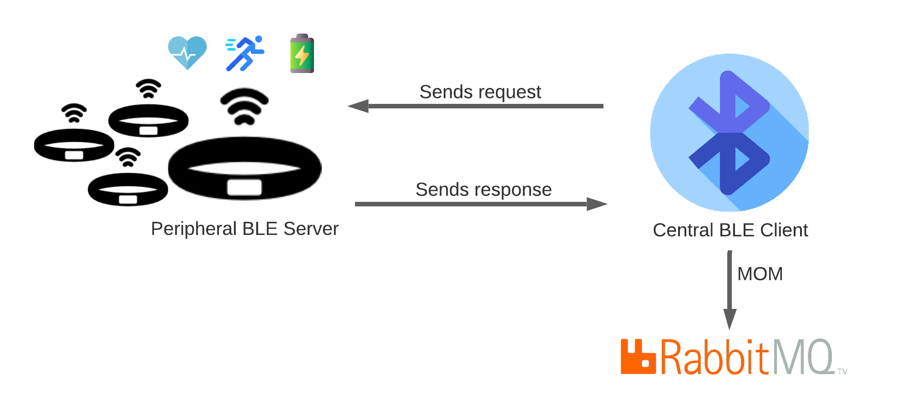

# IoT Mini Project » Bluetooth BLE

``` 
---------------------------------------------------------------------------
UA -> ESTGA -> MIA -> Tecnologias de Comunicação para a Internet das Coisas
Professor: Pedro Gonçalves
Estudante: Dante Marinho
---------------------------------------------------------------------------
```


Desenvolvimento de uma solução de IoT para a monitorização das atividades de uma pulseira Mi Band 3.
- Monitorizar número de passos.
- Monitorizar a bateria.
- Monitorizar batimentos cardíacos.
- Estabelecimento de mecanismos de poupança de bateria.


## Arquitetura do projeto



## Tasks do projeto

- Ler as Mi Band 3 presentes, através do Scanner.
- Aceder aos determinados servidos na pulseira:
    - Número de passos.
    - Nível da bateria.
    - Batimento cardíaco.
- MOM :: RabbitMQ.
- Impementar um servidor de GATT (o que vai ler a pulseira: gatway) completo (os sensores de serviços diferentes devem ser implementados como características independentes de serviços independentes) :: meu PC é o GATT Client e a pulseira é o GATT Server.
- Implementar scanner contínuo.

## Preparação do ambiente

1. Instalar o RabbitMQ
sudo apt install rabbitmq-server

2. Instalar a lista de dependências de pacotes do Python3

```
pip3 install -r requirements.txt
```

Lista de dependências:
```
bluepy==1.3.0
pika==1.1.0
pycrypto==2.6.1
```

Em caso de problema de instalação do bluepy, installar:  
sudo apt-get install libglib2.0-dev python3-dev  
https://stackoverflow.com/questions/46918646/bluepy-installation-error

## How to run the project

```
sudo python3 main.py
```

## Utilizades

- restart Bluetooth from terminal
```
sudo systemctl restart bluetooth
```

## Infos e configs úteis para o RabbitMQ

- Endereço: localhost:15672
- Ver status: service rabbitmq-server status
- restart dserver: service rabbitmq-server restart
- Habilitar RabbitMQ Management: sudo rabbitmq-plugins enable rabbitmq_management
- Adicionar novo user: sudo rabbitmqctl add_user <login_name> <password>
- Setar o user como admin: sudo rabbitmqctl set_user_tags dantiii administrator
- Listing queues for vhost: sudo rabbitmqctl list_queues

## Fontes

- Wrapper python script for Xiaomi Mi Band 3 and Mi Band 4  
https://github.com/mkborisov/mi-band-linux-wrapper

- Timer para loop infinito  
https://www.geeksforgeeks.org/how-to-create-a-countdown-timer-using-python/

## Description dependency libraries

- bluepy 1.3.0  
pip3 install bluepy  
https://pypi.org/project/bluepy/

- pip install pycryptodomex (How to use: from Cryptodome.Cipher import AES)

## Resolução de problemas

1. Em caso de problema de instalação do bluepy, installar:  
sudo apt-get install libglib2.0-dev python3-dev  
https://stackoverflow.com/questions/46918646/bluepy-installation-error

2. Em caso de loop infinito ao ler os batimentos cardíacos, o problema deixou de acontecer quando iniciei uma vez o programa "https://github.com/mkborisov/mi-band-linux-wrapper", escolhendo a opção "8 - Get Heart BPM"

3. Entrei numa instalação nova do Linux para rodar o programa do absoluto zero, passando por todas as configurações iniciais. Ao voltar para o meu sistema, deparei-me com o seguinte erro ao executar o programa (ou também ao tentar rodar o programa do "mkborisov"). Isto só foi solucionado após fazer um reset à pulseira Mi Band 3, geranço assim um novo Mac Address, e realizando um novo emparelhamento com o computador no momento da execução do programa.

```sh
(Command to run)$ sudo python3 main.py

» Getting data from Mi Band 3...

Scannig for Mi Bands 3 devices...

Discovered device e8:9e:71:e1:c6:eb
Discovered device 59:b3:2f:4e:77:1a
Discovered device 7e:83:03:d9:82:4c
Discovered device 6e:ac:3d:04:e9:10
Discovered device 44:5c:e9:75:ad:03
Discovered device 62:01:e5:11:0b:17
Discovered device 18:e0:be:e0:0c:e4

» 1 Mi Band 3 discovered!
» Getting Mi Band (e8:9e:71:e1:c6:eb) infos.

2021-01-16 23:06:14,613 MiBand3 (INFO) > Connecting to e8:9e:71:e1:c6:eb
2021-01-16 23:06:15,657 MiBand3 (INFO) > Connected
2021-01-16 23:06:17,727 MiBand3 (INFO) > Enabling Auth Service notifications status...
2021-01-16 23:06:17,918 MiBand3 (INFO) > Requesting random number...
Traceback (most recent call last):
  File "main.py", line 100, in <module>
    get_mi_band_infos(band)
  File "main.py", line 46, in get_mi_band_infos
    mi_band.authenticate()
  File "/home/dantiii/Desktop/UA Projetos/IoT-Proj/iot-monitoring-mi-band-3/auth.py", line 217, in authenticate
    self._req_rdn()
  File "/home/dantiii/Desktop/UA Projetos/IoT-Proj/iot-monitoring-mi-band-3/auth.py", line 120, in _req_rdn
    self.waitForNotifications(self.timeout)
  File "/usr/local/lib/python3.8/dist-packages/bluepy/btle.py", line 560, in waitForNotifications
    resp = self._getResp(['ntfy','ind'], timeout)
  File "/usr/local/lib/python3.8/dist-packages/bluepy/btle.py", line 407, in _getResp
    resp = self._waitResp(wantType + ['ntfy', 'ind'], timeout)
  File "/usr/local/lib/python3.8/dist-packages/bluepy/btle.py", line 362, in _waitResp
    raise BTLEDisconnectError("Device disconnected", resp)
bluepy.btle.BTLEDisconnectError: Device disconnected
```

## Anotações

Mac Adresses da f6:9e:71:df:3a:ca da minha Mi Band 3:  
- f6:9e:71:df:3a:ca
- e8:9e:71:e1:c6:eb
- ce:66:3c:61:74:19 (1º Mac Address)

O code para scanner da pulseira está na página 6 do ficheiro "Apresent8 - BLE Dev.pdf"
Working with notifications (página 7) é para o pessoal que vai usar Arduino

Ler dados de um ficheiro:  
```python
file_name = 'miband-mac-address.txt'
    file_miband = open(file_name, 'r')
    mibands_from_file = file_miband.readlines()

    if not len(mibands_from_file):
        print('You don\'t have any Mi Band 3 setted in {}.'.format(file_name))
```

Tarefas sugeridas

- Thread que faça o Scanner (transpor o código do Scan para dentro de uma Thread)
- É possivel le-la? Então lê e realiza utiliza uma MOM (Message Oriented Middleware) para manipular os dados

## Virtual envirementes em Pythons

-  Criação de venv  
python3 -m venv .venv  

- Ativar a venv
. .venv/bin/activate  

- Desativar a venv
deactivate (para desativar o venv)  